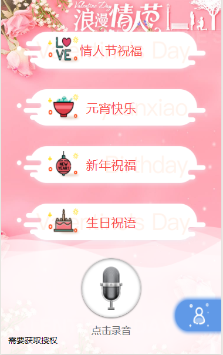
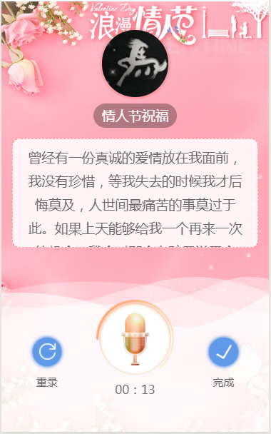
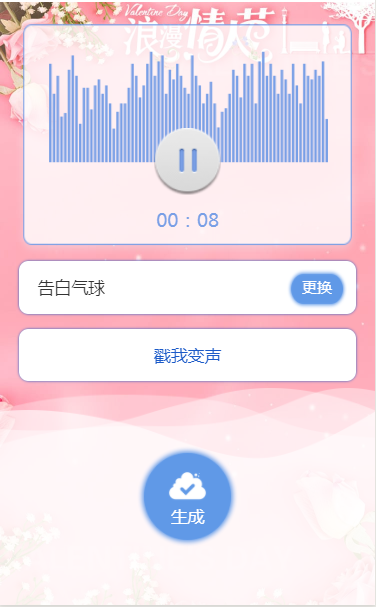
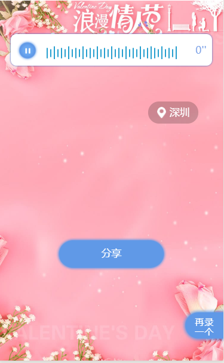

# 微信魔音祝语小程序
 
######微信小程序实现，小程序录音功能，魔音变音。

根据节日选择需要录制的节日祝福语，选择不同的祝语，可是是开心，共同的回忆或者是行走的段子手。

还可以试听一下别人的录音内容，玩出多重花样（根据节日随机获取录音内容）。在录音中也可以加入自己的博学渊识和幽默风趣的搞笑段子。

录制完成后可以选择不同的背景音乐和让祝福的人懵*的变声语调（变声有前台传音频到后台完成转换），最后分享给祝福的“对象”。

图片预览

